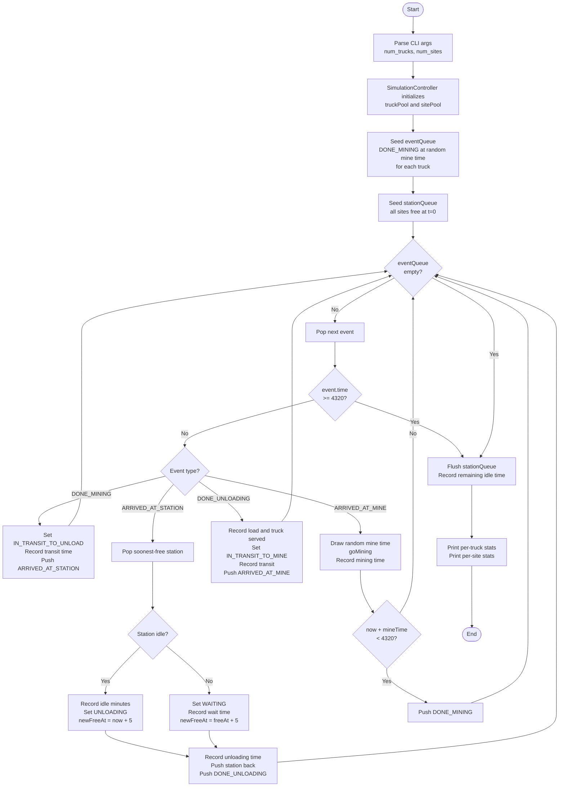

# Mining Simulation

A discrete-event simulation of a 72-hour lunar Helium-3 mining operation. Models n mining trucks cycling between mine sites and m unload stations over a 4,320-minute window.

## Usage

```bash
mkdir build
cd build/
cmake ..
make
```

```bash
./MiningSimulation <num_trucks> <num_sites>
./MiningSimulation 5 3     # 5 trucks, 3 unload stations
./MiningSimulation         # defaults: 5 trucks, 3 stations
```

At the end of the run, per-truck and per-station statistics are printed to stdout.

## Approach

The simulation uses an **event-driven architecture** rather than a minute-by-minute tick loop. Instead of iterating all 4,320 minutes and checking every truck each step, the simulation maintains a min-heap of future events ordered by sim time. Each event schedules the next event for that truck, so the loop only executes O(events) iterations — one per state transition — rather than O(minutes × trucks).

Trucks cycle through four events:

1. `DONE_MINING` — truck finished mining, begins transit to a station
2. `ARRIVED_AT_STATION` — truck arrives and is assigned to the soonest-free station
3. `DONE_UNLOADING` — truck finishes unloading, begins transit back to the mine
4. `ARRIVED_AT_MINE` — truck arrives at the mine and draws a new random mining duration

## Design Choices

**Event-driven over tick-based** — eliminates unnecessary iterations. For 5 trucks over 4,320 minutes the difference is minor, but the approach scales correctly and reflects how discrete-event simulators are built in practice.

**Station priority queue** — a second min-heap tracks when each station's backlog clears (`freeAt`). When a truck arrives, it always picks the station that will be free soonest in O(log m) time, replacing a linear scan.

**Value semantics** — `std::vector<MiningTruck>` and `std::vector<UnloadSite>` own objects directly. All pool sizes are known at startup, so zero heap allocations occur during the sim loop.

**`enum class TruckState`** — replaces raw integer status values with a scoped enum, making state transitions readable and preventing accidental misuse.

## Diagrams

### Initial Class Diagram

[Class Diagram here](InitialClassDiagram.png)

### Program Flow Diagram



## What I would do if I had more time

- **Config loading for timings, trucks and sites** — create a customizeable config to read in these values on start
- **CSV or JSON stats output** — make it easy to pipe results into analysis tools or plot efficiency curves across different truck/site ratios
- **Multiple runs with aggregated stats** — run the simulation k times with different seeds and report mean/stddev per metric to characterize steady-state behavior
- **Station wait-time histogram** — track the distribution of queue wait times per station, not just totals, to identify bottlenecks under different configurations
